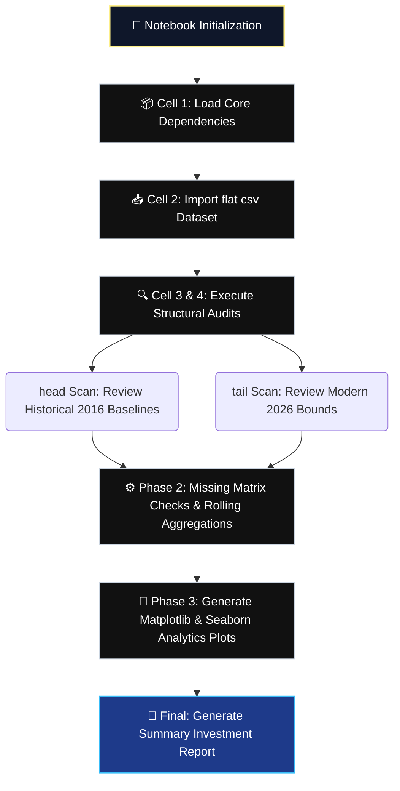

# Stock-Market-Analysis
# 📈 Stock Market Analysis Report

<div align="center">
  <!-- Premium Native CSS Animated Header Card -->
  <div style="background: linear-gradient(135deg, #0f172a 0%, #1e293b 100%); padding: 35px; border-radius: 12px; box-shadow: 0 6px 20px rgba(0,0,0,0.4); border: 2px solid #38bdf8; max-width: 680px; margin: 20px auto; overflow: hidden;">
    <h1 style="color: #fef08a; margin: 0 0 10px 0; font-family: 'Fira Code', monospace; font-size: 26px; text-shadow: 0 0 12px rgba(254,240,138,0.4);">📊 Time-Series Stock Market Analyzer</h1>
    
    <!-- CSS Typing Animation -->
    <div style="display: inline-block; font-family: 'Fira Code', monospace; font-weight: 600; font-size: 15px; color: #38bdf8; border-right: 2px solid #38bdf8; white-space: nowrap; overflow: hidden; width: 0; animation: typing 4s steps(45, end) infinite alternate;">
      OHLC Trends | Volatility Maps | Volumetric Trading Insights
    </div>
    
    <p style="color: #cbd5e1; margin: 15px 0 0 0; font-family: system-ui, sans-serif; font-size: 14px; line-height: 1.6;">
      A comprehensive data analytics project utilizing Python to explore historical stock data over a 10-year span. Cleans, aggregates, and charts financial pricing volatility and volume distributions.
    </p>
  </div>
</div>

<style>
  @keyframes typing {
    0% { width: 0; }
    75% { width: 100%; }
    100% { width: 100%; }
  }
</style>

---

## ⚡ Core Analytical Modules

Click open individual sections below to review the specific computational logic applied within the notebook:

<details open>
<summary><b>📖 1. Project Background & Scope</b></summary>
<br>

* 📈 **Market Tracking:** Analyzes daily pricing variations to interpret equity capitalization growth, liquidity thresholds, and holding risk over time.
* 📋 **Dataset Dimension:** Handles thousands of sequential daily rows tracing `Open`, `High`, `Low`, `Close`, and `Volume` columns chronologically from **2016 through 2026**.
</details>

<details>
<summary><b>🛠️ 2. Core Library Infrastructure</b></summary>
<br>

* 🐼 **Data Structuring (`pandas`):** Loads tabular series flat files and handles internal time-series parsing loops.
* 🧮 **Numerical Computations (`numpy`):** Evaluates mathematical arrays, moving averages, and risk spreads across coordinate parameters.
* 🎨 **Visual Plotting Libraries:** Leverages `matplotlib.pyplot` and `seaborn` configurations to plot line streams, histograms, and statistical covariance grids.
</details>

<details>
<summary><b>📈 3. Planned Visualization Outputs</b></summary>
<br>

* 📉 **Line Charts:** Chronological trend lines charting long-term progression curves for daily `Close` prices.
* 📊 **Bar Charts:** Visual representations evaluating periodic trading volumes to observe macro liquidity surges.
* 🔔 **Histograms:** Price distribution density blocks to pinpoint historical support and resistance zones.
* 🌡️ **Seaborn Heatmaps:** Correlation coefficients examining structural dependencies between OHLC columns and volume.
</details>

---

## 🗺️ Notebook Pipeline Workflow

The notebook runs through an structured extract-transform-visualize sequence across consecutive code execution cells:



---

## 🚀 Workspace Environment Setup

### 1. Installation Checklist
Ensure your Python package manager has all data engineering and charting dependencies configured before launching the notebook:
```bash
pip install pandas numpy matplotlib seaborn notebook
```

### 2. Launch Notebook Environment
Run the command below in your local directory path to interact with the file cells:
```bash
jupyter notebook Stock_Market_Analysis.ipynb
```

---

## 💻 Sample Dataset Shape & Visibility

The notebook handles continuous time-series rows tracking equity logs across a 10-year spectrum. Below is an excerpt of the edge structures:

```text
Dataset Dimensions: [2514 rows x 6 columns]

>>> stock_df.head() (September 2016 Initial Baselines)
         Date     Open     High      Low    Close     Volume
0  12-09-2016  23.5162  24.2197  23.4885  24.1577  178592228
1  13-09-2016  24.6299  24.9241  24.5660  24.7328  267326800
2  14-09-2016  24.9093  25.8916  24.8830  25.6079  464212365

>>> stock_df.tail() (September 2026 Target Closures)
           Date     Open     High      Low    Close     Volume
2511  09-09-2026  315.485  319.150  309.90  315.340   65639962
2512  10-09-2026  316.670  326.730  316.51  326.570   70011913
2513  11-09-2026  327.450  336.220  326.30  332.270   50716865
```

---

<!-- GitHub-Friendly Professional UI Custom Theme Style -->
<style>
  summary {
    font-size: 1.1rem;
    padding: 14px;
    background: #0f172a;
    border-radius: 8px;
    margin-bottom: 10px;
    cursor: pointer;
    border-left: 4px solid #38bdf8;
    transition: all 0.2s ease-in-out;
    list-style: none;
    font-family: system-ui, sans-serif;
    color: #cbd5e1;
  }
  summary:hover {
    background: #1e293b;
    transform: translateX(4px);
    color: #fef08a;
  }
  summary::-webkit-details-marker {
    display: none;
  }
</style>
