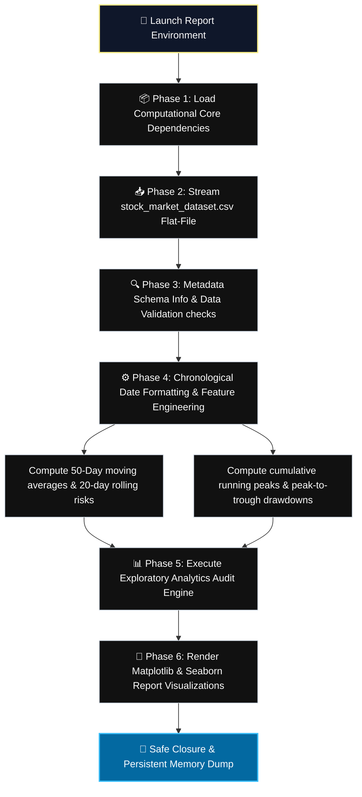

# Stock-Market-Analysis
# 📈 Stock Market Analysis Report

<div align="center">
  <!-- Premium Native CSS Animated Header Card -->
  <div style="background: linear-gradient(135deg, #0f172a 0%, #0369a1 100%); padding: 35px; border-radius: 12px; box-shadow: 0 6px 20px rgba(0,0,0,0.4); border: 2px solid #38bdf8; max-width: 680px; margin: 20px auto; overflow: hidden;">
    <h1 style="color: #fef08a; margin: 0 0 10px 0; font-family: 'Fira Code', monospace; font-size: 26px; text-shadow: 0 0 12px rgba(254,240,138,0.4);">📊 Time-Series Stock Market Analyzer</h1>
    
    <!-- CSS Typing Animation -->
    <div style="display: inline-block; font-family: 'Fira Code', monospace; font-weight: 600; font-size: 15px; color: #38bdf8; border-right: 2px solid #38bdf8; white-space: nowrap; overflow: hidden; width: 0; animation: typing 4s steps(45, end) infinite alternate;">
      OHLC Trends | Historical Volatility | Portfolio Drawdowns
    </div>
    
    <p style="color: #cbd5e1; margin: 15px 0 0 0; font-family: system-ui, sans-serif; font-size: 14px; line-height: 1.6;">
      A comprehensive data science framework leveraging Python to inspect historical daily stock data. Cleans sequence timelines, extracts statistical volatility matrices, and computes rolling financial indicator models.
    </p>
  </div>
</div>

<style>
  @keyframes typing {
    0% { width: 0; }
    75% { width: 100%; }
    100% { width: 100%; }
  }
</style>

---

## ⚡ Core Pipeline Features

Click open individual database phase folders below to look closer into specific execution layers:

<details open>
<summary><b>🛠️ 1. Data Preparation & Feature Engineering</b></summary>
<br>

* 🗓️ **Chronological Alignment:** Converts raw object date strings (`DD-MM-YYYY`) into rigorous `datetime64[ns]` formats, sorting lines continuously to maintain chronological sequence integrity.
* ➕ **Derived Financial Technical Indicators:** Engineered fields computed across the historical vector space:
  - **`Day_Range`**: Daily trading spread tracking (High - Low).
  - **`MA_50`**: 50-day Simple Moving Average calculation for underlying trend filtration.
  - **`Pct_Change`**: Percentage returns relative to the preceding session's closing index.
  - **`Rolling_Risk`**: 20-day rolling statistical standard deviation to trace active volatility risk shifts.
  - **`Drawdown_%`**: Peak-to-trough degradation measurement mapped relative to running historical maximums (`cummax`).
</details>

<details>
<summary><b>📈 2. Exploratory Data Analysis (EDA) Summary</b></summary>
<br>

* 🔍 **Structural Profiling:** Processes **2,514 active trading days** mapping across an initial schema footprint (`Date`, `Open`, `High`, `Low`, `Close`, `Volume`) with **0 duplicate logs** and **0 null values**.
* 📉 **Growth Analysis:** Traces equity progression from a baseline close of **\$24.16** (Sept 2016) up to a contemporary valuation of **\$332.27** (Sept 2026), capturing an aggregate return of **+1,275.42%**.
* 🚦 **Market Volatility Audits:** Captures standard market behavior parameters, logging historical anomalies such as the high-volatility window of **March 2020** (6.80% rolling risk due to the single worst day drop of **-12.86%** on 2020-03-16).
</details>

<details>
<summary><b>🎨 3. Data Visualization Blueprint</b></summary>
<br>

* 📉 **Line Charts:** Long-term market performance charting closing prices alongside the secondary `MA_50` smoothing line.
* 📊 **Bar Charts:** Aggregated volume visualization evaluating macroscopic monthly distribution shifts.
* 🔔 **Histograms:** Frequency density layouts graphing return anomalies to trace distribution normality metrics.
* 🌡️ **Seaborn Correlation Heatmaps:** Multi-variable matrix plots mapping the correlation coefficients between volume limits and OHLC vectors.
</details>

---

## 🗺️ Execution Workflow Architecture

The program initializes dependencies, checks schema boundaries, applies data transformations, and computes analytical data metrics through consecutive operational cells:



---

## 🚀 Environment Setup & Deployment

### 1. Verification Dependencies Install
Ensure your local Python environment has the mandatory data-science and visualization libraries configured before running the code rows:
```bash
pip install pandas numpy matplotlib seaborn notebook
```

### 2. Runtime Execution
Launch the Jupyter framework to access the code workspace cells:
```bash
jupyter notebook Stock_Market_Analysis.ipynb
```

---

## 💻 Tabular DataFrame Schema Metric Baselines

### Summary Statistical Matrix (`stock_df.describe()`)

| Metric | Open | High | Low | Close | Volume |
| :--- | :--- | :--- | :--- | :--- | :--- |
| **Count** | 2,514.00 | 2,514.00 | 2,514.00 | 2,514.00 | 2.514000e+08 |
| **Mean** | \$132.27 | \$133.74 | \$130.94 | \$132.41 | 9.742266e+07 |
| **Std Dev**| \$80.87 | \$81.77 | \$80.09 | \$80.98 | 5.742578e+07 |
| **Min** | \$23.52 | \$24.22 | \$23.49 | \$24.16 | 1.792733e+07 |
| **Max** | \$340.03 | \$344.57 | \$337.35 | \$340.08 | 4.788416e+08 |

### Engineered Features Snapshot (`stock_df.tail()`)
```text
Dataframe Tail View (September 2026 Closures Tracking Log):
Date        Close    Year  Day_Range  MA_50     Pct_Change  Rolling_Risk  Drawdown_%
2026-09-08  316.22   2026  5.80       315.8002  -1.171985   1.327886      -7.015996
2026-09-09  315.34   2026  9.25       316.4722  -0.278287   1.300735      -7.274759
2026-09-10  326.57   2026  10.22      317.2164   3.561235   1.478284      -3.972595
2026-09-11  332.27   2026  9.92       317.9742   1.745414   1.503524      -2.296518
```

---

<!-- GitHub-Friendly Professional UI Custom Theme Style -->
<style>
  summary {
    font-size: 1.1rem;
    padding: 14px;
    background: #0f172a;
    border-radius: 8px;
    margin-bottom: 10px;
    cursor: pointer;
    border-left: 4px solid #38bdf8;
    transition: all 0.2s ease-in-out;
    list-style: none;
    font-family: system-ui, sans-serif;
    color: #cbd5e1;
  }
  summary:hover {
    background: #1e293b;
    transform: translateX(4px);
    color: #fef08a;
  }
  summary::-webkit-details-marker {
    display: none;
  }
</style>
